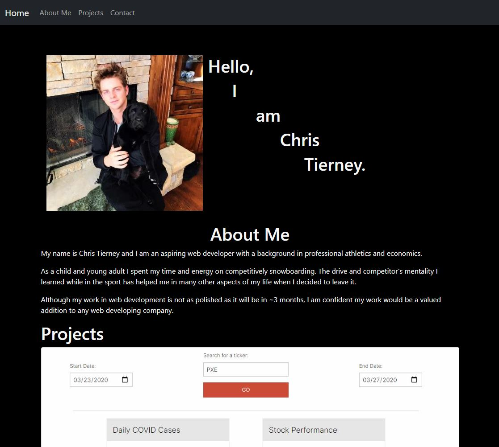

** Here is an updated look at my dev portfolio. 

** I chose to add a navbar to make scrolling the page seamless and hassle-free.

** Underneath I included a picture of myself with my dog, Ray and included my name and an about me.

** I then included some of the projects I have recently completed with buttons that will direct the user to their deployed applications. This includes our most recent project, Bracket Bois, which can be used to create, edit and delete tournaments for any applicable event!

** My main contact information is then displayed in the footer where the user will be taken to either my LinkedIn, Github, or my Resume.

## Contact info
Email: chris.tierney3@gmail.com
LinkedIn: https://www.linkedin.com/in/chris-tierney-833611180/